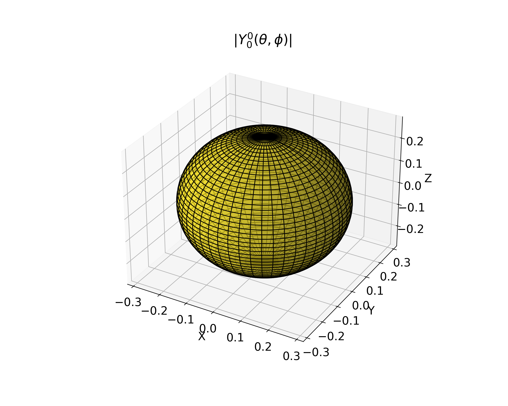
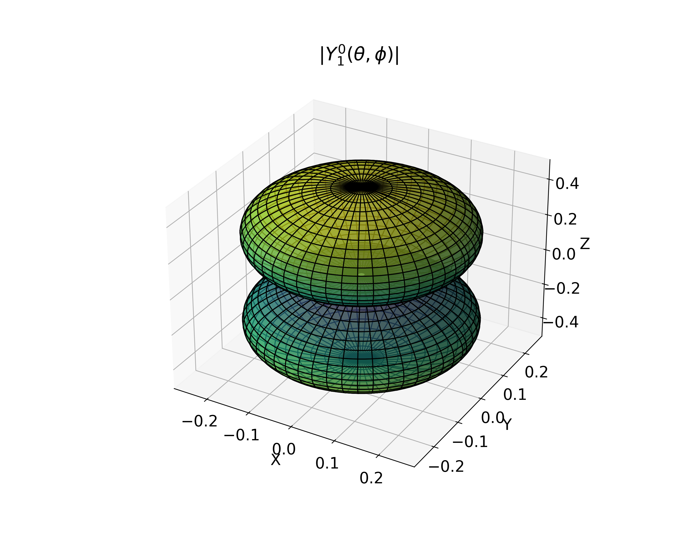
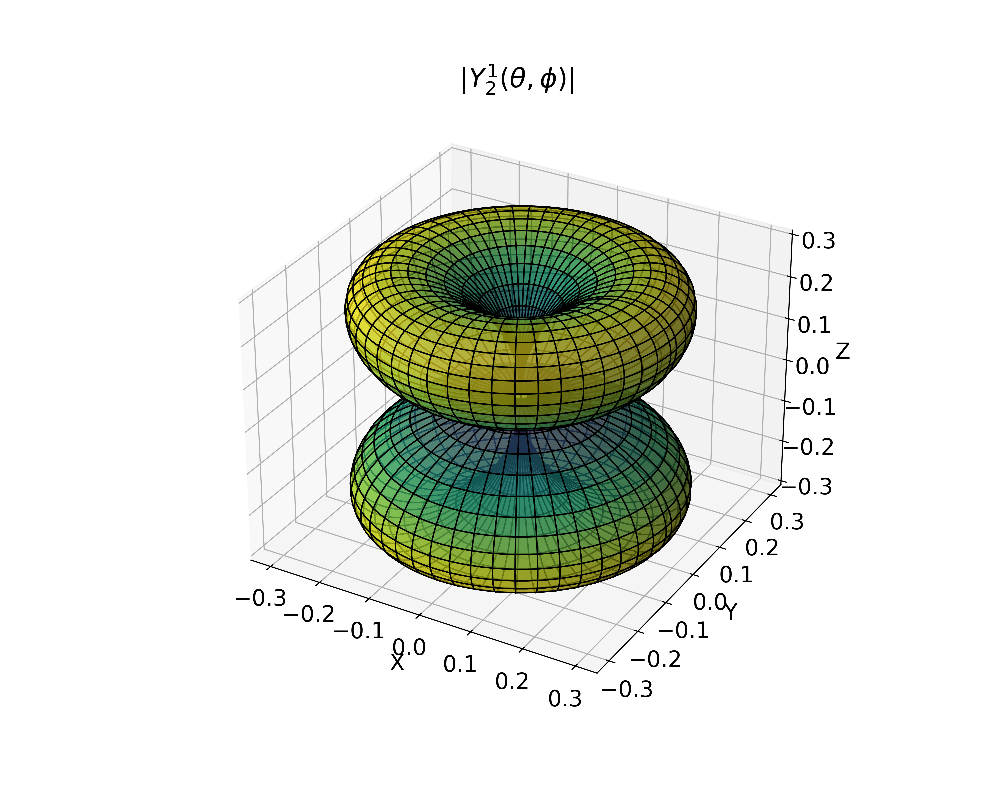

+++ {"oxa":"oxa:a7oQQocM3jAjAuctG9ns/EwVzzB1bK5NVhOgwJlfR.1","tags":[]}

:::{aside} Adrien-Marie Legendre
destacado matemático francés. Realizó importantes contribuciones a la estadística, a la teoría de números, al álgebra abstracta y al análisis matemático. Intervino en geodesia y en la comisión que estableció el metro como unidad de medida internacional.

```{figure} ./../images/legendre.jpg
:label: fig-legendre-retrato
:alt: retrato de Legendre
:align: center
Adrien-Marie Legendre  (1752-1833)
```

:::

```{note} Objetivos
Al completar esta lección, serás capaz de
1. comprender la importancia y la aplicación de las funciones especiales, específicamente los polinomios de Legendre, en la física e ingeniería.
2. realizar operaciones numéricas con polinomios de Legendre, mediante bibliotecas de python.
```

:::{tip} Contenidos

- [Ecuaciones de Sturm-Liouville](#sturm-liouville)
- [Polinomios de Legendre](#polinomios-legendre)
- [Polinomios asociados de Legendre](#polinomios-asociados-legendre)
- [Armónicos esféricos](#armonicos-esfericos)
  :::

+++ { "part": "abstract" }  
Las funciones especiales son un conjunto de funciones matemáticas que surgen con frecuencia en la resolución de problemas en física, ingeniería y otras áreas de las matemáticas aplicadas. Estas funciones son especialmente útiles porque modelan fenómenos físicos y matemáticos específicos de
manera precisa y eficiente.

En física y matemáticas, las funciones especiales se utilizan para describir una amplia gama de fenómenos, desde el movimiento de partículas subatómicas hasta la propagación de ondas electromagnéticas, pasando por la resolución de ecuaciones diferenciales que modelan sistemas físicos complejos.

Los polinomios de Legendre surgen en problemas de electrostática, magnetismo y mecánica cuántica, especialmente en el estudio de la simetría
esférica.
+++

(sturm-liouville)=

# Ecuaciones de Sturm-Liouville

Una [_ecuación de Sturm-Liouville_](https://es.wikipedia.org/wiki/Teor%C3%ADa_de_Sturm-Liouville) es una EDO de segundo orden de la forma

```{math}
:label: eq-sturm-liouville
p(x)\frac{d^2 y}{dx^2}+r(x)\frac{dy}{dx}+q(x)y=\lambda \rho(x)y
```

donde {math}`r(x)=\displaystyle\frac{dp(x)}{dx}` y {math}`p`, {math}`q` y {math}`r` son funciones reales de {math}`x`. {math}`\rho(x)` se denomida _función de peso_.

Las soluciones a la ecuación de Sturm-Liouville que satisfagan condiciones de frontera apropiadas son las eigen-funciones de un operador Hermítico:

```{math}
\mathcal{L}y=\lambda \rho(x)y,
```

donde

```{math}
\mathcal{L}\equiv - \left[p(x)\frac{d^2}{dx^2}+r(x)\frac{d}{dx}+q(x)\right]
```

o

```{math}
\mathcal{L}\equiv - \left\{\frac{d}{dx}\left[p(x)\frac{d}{dx} \right]+q(x)\right\}.
```
El valor de $\lambda$ no se especifica en la ecuación. Encontrar los valores $\lambda$ para los que exista una solución no trivial de la ecuación que satisfaga las condiciones de frontera se denomina el **problema de Sturm-Liouville**.


:::{table} Ecuaciones diferenciales especiales en la forma de Sturm-Liouville
:label: tab-sturm-liouville
:align: center

| Ecuación | $p(x)$    | $q(x)$       | $\lambda$  | $\rho(x)$ | Intervalo          |
|----------|-----------|--------------|------------|-----------|--------------------|
| Legendre | $1 - x^2$ | 0            | $-n(n+1)$   | 1         | $[-1, 1]$          |
| Bessel   | $x$       | $-\nu^2/x$   | $\alpha^2$ | $x$       | $(0, \infty)$      |
| Hermite  | $e^{-x^2}$| 0            | $2\nu$     | $e^{-x^2}$| $(-\infty, \infty)$|
| Laguerre | $xe^{-x}$ | 0            | $\nu$      | $e^{-x}$  | $(0, \infty)$      |
:::

(polinomios-legendre)=

# Polinomios de Legendre

Los [_polinomios de Legendre (de orden $n$)_](https://es.wikipedia.org/wiki/Polinomios_de_legendre) son las soluciones de la EDO
$$\frac{d}{dx}\left[ (1 - x^2)\frac{d}{dx}P_n(x)\right] + n(n + 1) P_n(x) = 0, \quad n=0,1,2,\ldots$$
$P_n(x)$ es un polinomio de orden $n$. Este puede ser expresado usando la Fórmula de Rodrigues:
$$P_n(x) = \frac{1}{2^n \cdot n!} \frac{d^n}{dx^n} (x^2 - 1)^n.$$

Los polinomios $P_n(x)$ son ortogonales sobre el intervalo $[-1,1]$; con
función de peso $\rho=1$. Esta condición se expresa mediante la siguiente integral:

```{math}
\int_{-1}^{1} P_m(x) P_n(x) \, dx = \frac{2}{2n + 1} \delta_{mn}
```

donde $P_m(x)$ y $P_n(x)$ son los polinomios de Legendre de orden $
m$ y $n$, respectivamente, y $\delta_{mn}$ es el delta de Kronecker, que es 1 si $m=n$ y 0 en caso contrario.

:::{table} Polinomios de Legendre
:label: table-legendre
:align: center

| Orden ($n$) | $P_n(x)$                            |
| ----------- | ------------------------------------|
| 0           | $1$                              |
| 1           | $x$                             |
| 2           | $1.50x^2 -0.50$                     |
| 3           | $2.50x^3 -1.50x$                    |
| 4           | $4.38x^4 -3.75x^2 + 0.38$           |
| 5           | $7.88x^5 -8.75x^3 + 1.88x$          |
| 6           | $14.44x^6 -19.69x^4 + 6.56x^2-0.31$ |

:::

```{figure} ./polinomios_legendre.png
:label: fig-legendre
:alt: Gráfica de los primeros cuatro polinomios de Legendre.
:align: center

Polinomios de Legendre $P_n(x)$
```

```{figure} ./polinomios_legendre_2.png
:label: fig-legendre-2
:alt: Gráfica de los primeros cuatro polinomios de Legendre, $P_l(cos theta)$.
:align: center

Polinomios de Legendre $P_n(\cos\theta)$
```

Los polinomios de Legendre se utilizan comúnmente en la resolución de
ecuaciones diferenciales que describen problemas con simetría esférica,
como la ecuación de Laplace en coordenadas esféricas.

:::{note} Ecuación de Laplace y polinomios de Legendre
:class: dropdown
La ecuación de Laplace está definida por
$$
\nabla^2 \Phi = 0.
$$

En coordenadas esféricas toma la forma 

$$
\nabla^2 \Phi = \frac{1}{r^2} \frac{\partial}{\partial r} \left( r^2 \frac{\partial \Phi}{\partial r} \right) + \frac{1}{r^2 \sin\theta} \frac{\partial}{\partial \theta} \left( \sin\theta \frac{\partial \Phi}{\partial \theta} \right) + \frac{1}{r^2 \sin^2\theta} \frac{\partial^2 \Phi}{\partial \phi^2} = 0.
$$
Para resolver esta ecuación, se puede usar la separación de variables y expandir la solución en términos de los polinomios de Legendre $P_l(\cos\theta)$. La solución general para el potencial fuera de la esfera (en la región $r>R$, donde $R$ es el radio de la esfera) es:
$$
\Phi(r,\theta)=\sum_{l=0}^{\infty}\left(A_lr^{-l-1}+B_lr^l\right)P_l(\cos\theta)
$$

Aquí, $A_l$ y $B_l$ son constantes que se determinan a partir de las condiciones de contorno del problema, y $P_l(\cos \theta)$ son los polinomios de Legendre.
:::

Los polinomios de Legendre son útiles en el desarrollo en series de funciones como

:::{math}
\frac{1}{|\vec{r}-\vec{r}^\prime|}=\frac{1}{\sqrt{r^2+r^{\prime 2}-2r r^\prime \cos\gamma}}=\sum^\infty_{l=0} \frac{r^{\prime l}}{r^{l+1}}P_l (\cos \gamma)
:::

Los polinomios de Legendre satisfacen la _relación de recurrencia_
```{math}
 (l+1)P_{l+1}(x)-(2l+1)xP_l(x)+lP_{l-1}(x)=0 
```
Además, satisfacen la _relación de paridad_

```{math}
P_n(-x)=(-1)^n P_n(x),
```
es decir, los polinomios de Legendre son pares o impares dependiendo si $n$ es par o impar.

(polinomios-asociados-legendre)=

:::{note} Expansión multipolar y los polinomios de Legendre
:class: dropdown
La **expansión multipolar** es una técnica matemática utilizada en física para describir el comportamiento de un campo en función de una distribución de fuentes. Es especialmente útil en electrodinámica, gravitación y mecánica cuántica donde las soluciones a ecuaciones diferenciales de campos se expresan en términos de **series de funciones ortogonales**, como los polinomios de Legendre y los armónicos esféricos.

Un campo $ \Phi(\mathbf{r}) $ generado por una distribución de fuentes puede expandirse en términos de funciones que reflejan su simetría. Para problemas con simetría esférica, la expansión se realiza en términos de **potenciales multipolares**:

```{math}
\Phi(\mathbf{r}) = \sum_{l=0}^{\infty} \left( A_{l} r^{l} + B_{l} r^{-(l+1)} \right) P_{l}(\cos\theta)
```

donde
- $ P_{l}(\cos\theta) $ son los polinomios de Legendre.
- $ A_{l} $ y $ B_{l} $ son coeficientes determinados por las condiciones de frontera.
- $ l $ representa el orden multipolar, con $ l = 0 $ para el **monopolo**, $ l = 1 $ para el **dipolo**, $ l = 2 $ para el **cuadrupolo**, etc.

En el caso de un dipolo eléctrico, el potencial $ V $ a una distancia $ r $ del dipolo en la dirección $ \theta $ se puede expresar como:
$$
V(r, \theta) = \frac{p \cos \theta}{4 \pi \epsilon_0 r^2}
$$
donde $p$ es el momento dipolar y $\epsilon_0$ es la permitividad del vacío.
:::


# Polinomios asociados de Legendre

Los [polinomios asociados de Legendre](https://es.wikipedia.org/wiki/Polinomios_asociados_de_legendre) son una extensión de los polinomios de Legendre. Denotados como $P_l^m(x)$, dependen de dos parámetros enteros: el grado $l$ y el orden $m$. La ecuación diferencial de Legendre es:

```{math}
(1 - x^2) \frac{d^2 y}{dx^2} - 2x \frac{dy}{dx} + \left[l(l + 1) - \frac{m^2}{1 - x^2}\right] y = 0
```

```{figure} ./polinomios_asociados_legendre.png
:label: fig-legendre-asociados
:alt: Gráfica polinomios asociados de Legendre, $P_l^m(\cos \theta)$.
:align: center
Polinomios asociados de Legendre $P_l^m(\cos \theta)$.
```

Para valores enteros no negativos de $l$ y $m$, los polinomios asociados de Legendre se definen en términos de las derivadas de los polinomios de Legendre ordinarios:

```{math}
P_l^m(x) = (-1)^m (1 - x^2)^{m/2} \frac{d^m}{dx^m} P_l(x)
```

donde $P_l(x)$ es el polinomio de Legendre de orden $l$. $P_l^m(x)$ se llama _polinomio de Legendre de grado_ $l$ _y orden_ $m$, con $l$ y $m$ 
enteros y $0 \leq m \leq l$. El término $(-1)^m$ es conocido como la fase de _Condon-Shortley_.

Las funciones con un $m$ negativo, son proporcionales a las funciones con $m$ positivo:

```{math}
P_l ^{-m} = (-1)^m \frac{(l-m)!}{(l+m)!} P_l^{m}
```
Algunos ejemplos de polinomios asociados de Legendre se muestran en la [Tabla %s](#table-legendre-asociados)

:::{table} Ejemplos de polinomios asociados de Legendre
:label: table-legendre-asociados
:align: center

| Función          | Expresión                                |
|------------------|------------------------------------------|
| $P_{0}^{0}(x)$ | 1                                        |
| $P_{1}^{-1}(x)$| $-\frac{1}{2}P_{1}^{1}(x)$             |
| $P_{1}^{0}(x)$ | $x$                                    |
| $P_{1}^{1}(x)$ | $-(1-x^2)^{1/2}$                       |
| $P_{2}^{-2}(x)$| $\frac{1}{24}P_{2}^{2}(x)$             |
| $P_{2}^{-1}(x)$| $-\frac{1}{6}P_{2}^{1}(x)$             |
| $P_{2}^{0}(x)$ | $\frac{1}{2}(3x^{2}-1)$                |
| $P_{2}^{1}(x)$ | $-3x(1-x^2)^{1/2}$                     |
| $P_{2}^{2}(x)$ | $3(1-x^2)$                             |
| $P_{3}^{-3}(x)$| $-\frac{1}{720}P_{3}^{3}(x)$           |
| $P_{3}^{-2}(x)$| $\frac{1}{120}P_{3}^{2}(x)$            |
| $P_{3}^{-1}(x)$| $-\frac{1}{12}P_{3}^{1}(x)$            |
| $P_{3}^{0}(x)$ | $\frac{1}{2}(5x^3-3x)$                 |
| $P_{3}^{1}(x)$ | $-\frac{3}{2}(5x^{2}-1)(1-x^2)^{1/2}$  |
| $P_{3}^{2}(x)$ | $15x(1-x^2)$                           |
| $P_{3}^{3}(x)$ | $-15(1-x^2)^{3/2}$                     |
:::

Los polinomios asociados de Legendre satisfacen la relación de ortogonalidad

```{math}
\int^{1}_{-1}P^m_n(x) P^k_n(x)(1-x^2)^{-1}dx=\frac{(n+m)!}{m(n-m)!}\delta_{mk}
```

y la relación de paridad
```{math}
P_n^m(-x)=(-1)^{n+m}P_n^m(x)
```

y la relación de recurrencia
```{math}
(l - m + 1) P_{l+1}^{m}(x) - (2l + 1)x P_{l}^{m}(x) + (l + m) P_{l-1}^{m}(x) = 0.
```
(armonicos-esfericos)=

# Armónicos esféricos

Los _{term}`Armónicos esféricos`_ son funciones armónicas que representan la
variación espacial de un conjunto ortogonal de soluciones de la ecuación
de Laplace cuando la solución se expresa en coordenadas esféricas.

```{math}
Y_l^m(\theta, \phi) = A_l^m  \, P_l^m(\cos \theta) \, e^{im\phi}    ,
```

donde

$$A_l^m=\sqrt{\frac{2l + 1}{4\pi} \frac{(l - m)!}{(l + m)!}}.$$

$Y_{l}^m$ se llama _función armónica esférica de grado $l$ y orden $m$_.

Algunos ejemplos de armónicos esféricos en la [Tabla %s](#table-armonicos-esfericos).


:::{table} Ejemplos de armónicos esféricos
:label: table-armonicos-esfericos
:align: center

| Función                 | Expresión                                                      |
|-------------------------|----------------------------------------------------------------|
| $Y_0^0(\theta, \phi)$   | $\frac{1}{2} \sqrt{\frac{1}{\pi}}$                             |
| $Y_1^{-1}(\theta, \phi)$| $\frac{1}{2} \sqrt{\frac{3}{2\pi}}e^{-i\phi} \sin(\theta)$     |
| $Y_1^0(\theta, \phi)$   | $\frac{1}{2} \sqrt{\frac{3}{\pi}}\cos(\theta)$                 |
| $Y_1^1(\theta, \phi)$   | $-\frac{1}{2} \sqrt{\frac{3}{2\pi}}e^{i\phi} \sin(\theta)$     |
:::

Los armónicos esféricos satisfacen que 
```{math}
Y_l^m(\theta,\phi)=(-1)^m[Y_l^m(\theta,\phi)]^*
```
así como la relación de ortogonalidad
```{math}
\int^1_{-1}\int_0^{2\pi}[Y^m_l(\theta,\phi)]^*Y^{m^\prime}_{l^\prime}(\theta,\phi)d\phi d(\cos\theta)=\delta_{l l^\prime}\delta_{m m^\prime}
```

:::{figure} 
:label: fig-armonicos-esfericos
:alt: Gráfica armonico esferico, $Y_l^m(\cos \theta)$.
:align: center










Ejemplos de armónicos esféricos $|Y_l^m(\theta, \phi)|$.
:::


:::{note} Armónicos esféricos y la mecánica cuántica
:class: dropdown

El momento angular en mecánica cuántica está descrito por el operador $\hat{L}$, cuyos componentes satisfacen la relación de conmutación:  

$$[\hat{L}_i, \hat{L}_j] = i\hbar \epsilon_{ijk} \hat{L}_k$$

donde $\hat{L}^2$ y $\hat{L}_z$ conmutan, por lo que comparten funciones propias. Las ecuaciones de autovalores para estas cantidades son:

$$\hat{L}^2 Y_{l}^{m}(\theta, \phi) = \hbar^2 l (l+1) Y_{l}^{m}(\theta, \phi)$$

$$\hat{L}_z Y_{l}^{m}(\theta, \phi) = \hbar m Y_{l}^{m}(\theta, \phi)$$

donde:
- $l$ es el número cuántico asociado al momento angular total,
- $m$ es el número cuántico magnético asociado a la componente $z$ del momento angular.

:::


:::{seealso} Referencias
@boas2006mathematical [Cap. 12, pag. 562-584]

@arfken2005mathematical [Cap. 12, pag. 741-792]

@riley2006mathematical [Cap. 18, pag. 577-595]
:::